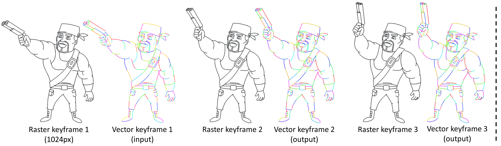

# Joint Stroke Tracing and Correspondence for 2D Animation - TOG & SIGGRAPH 2024

[[Paper]](https://dl.acm.org/doi/10.1145/3649890) | [[Project Page]](https://markmohr.github.io/JoSTC/)

This code is used for producing stroke tracing and correspondence results, which can be imported into an inbetweening product named [CACANi](https://cacani.sg) for making 2D animations.

The code (in pytorch) and trained models are coming soon!

