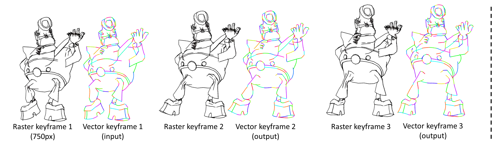

# Joint Stroke Tracing and Correspondence for 2D Animation - TOG & SIGGRAPH 2024

[[Paper]](https://www.sysu-imsl.com/files/TOG2024/SketchTracing_TOG2024_personal.pdf) | [[Paper (ACM)]](https://dl.acm.org/doi/10.1145/3649890) | [[Project Page]](https://markmohr.github.io/JoSTC/)

This code is used for producing stroke tracing and correspondence results, which can be imported into an inbetweening product named [CACANi](https://cacani.sg) for making 2D animations.




## Outline
- [Dependencies](#dependencies)
- [Quick Start](#quick-start)
- [Vector Stroke Correspondence Dataset](#vector-stroke-correspondence-dataset)
- [Citation](#citation)

## Dependencies
 - [cudatoolkit](https://www.anaconda.com/download/) == 11.0.3
 - [cudnn](https://www.anaconda.com/download/) == 8.4.1.50
 - [pytorch](https://pytorch.org/) == 1.9.0
 - [torchvision](https://pytorch.org/vision/0.9/) == 0.9.0
 - [diffvg](https://github.com/BachiLi/diffvg)
 - [Krita](https://krita.org/en/): for making reference vector frame
 - [CACANi](https://cacani.sg/): for making inbetweening and 2D animation

## Quick Start

### Model Preparation

Download the models [here](https://drive.google.com/drive/folders/15oAP7YbNKx4Cx1AmzC16wuoyQoAai2YV?usp=sharing), and place them in this file structure:
```
models/
    quickdraw-perceptual.pth
    point_matching_model/
        sketch_correspondence_50000.pkl
        transform_module/
            sketch_transform_30000.pkl
    stroke_tracing_model/
        sketch_tracing_30000.pkl
```

### Create Reference Vector Frames with Krita

Our method takes as inputs consecutive raster keyframes and a single vector drawing from the starting keyframe, and then generates vector images for the remaining keyframes with one-to-one stroke correspondence. So we have to create the vector image for the reference frame here. 

**Note**: We provide several examples for testing in directory `sample_inputs/`. If you use them, you can skip step-1 and step-2 below and execute step-3 directly.

1. Our method takes squared images as input, so please preprocess the images first using [tools/image_squaring.py](https://github.com/MarkMoHR/JoSTC/blob/main/tools/image_squaring.py):
```
python3 tools/image_squaring.py --file path/to/the/image.png
```

2. Follow tutorial [here](https://github.com/MarkMoHR/JoSTC/blob/main/tutorials/Krita_vector_generation.md) to make vector frames as a reference in svg format with [Krita](https://krita.org/en/).
3. Place the svg files in `sample_inputs/*/svg/`. Then, convert them into npz format using [tools/svg_to_npz.py](https://github.com/MarkMoHR/JoSTC/blob/main/tools/svg_to_npz.py):
```
cd tools/
python3 svg_to_npz.py --database ../sample_inputs/rough/ --reference 23-0.png
```

### Execute the Main Code

Perform joint stroke tracing and correspondence using [sketch_tracing_inference.py](https://github.com/MarkMoHR/JoSTC/blob/main/sketch_tracing_inference.py). We provide several examples for testing in directory `sample_inputs/`.
```
python3 sketch_tracing_inference.py --dataset_base sample_inputs --data_type rough --img_seq 23-0.png 23-1.png 23-2.png
```
  - `--data_type`: specify the image type with `clean` or `rough`.
  - `--img_seq`: specify the animation frames here. The first one should be the reference frame.
  - The results are placed in `outputs/inference/*`. Inside this folder:
    - `raster/` stores rendered line drawings of the target vector frames.
    - `rgb/` stores visualization (with target images underneath) of the vector stroke correspondence to the reference frame.
    - `rgb-wo-bg/` stores visualization without target images underneath.
    - `parameter/` stores vector stroke parameters.

### Create Inbetweening and Animation with CACANi

1. Convert the output npz file (vector stroke parameters) into svg format using [tools/npz_to_svg.py](https://github.com/MarkMoHR/JoSTC/blob/main/tools/npz_to_svg.py):
```
cd tools/
python3 npz_to_svg.py --database_input ../sample_inputs/ --database_output ../outputs/inference/ --data_type rough --file_names 23-1.png 23-2.png
```
  - The results are placed in `outputs/inference/*/svg`. There are two kinds of results:
    - `chain/`: the svg files store stroke chains, defining each path as a chain.
    - `separate/`: the svg files store separated strokes, defining each path as a single stroke. **Note that the automatic inbetweening in [CACANi](https://cacani.sg/) relies on this format.**

2. Follow tutorial [here](https://github.com/MarkMoHR/JoSTC/blob/main/tutorials/CACANi_inbetweening_generation.md) to generate inbetweening and 2D animation with [CACANi](https://cacani.sg/).

### More Tools

- [tools/vis_difference.py](https://github.com/MarkMoHR/JoSTC/blob/main/tools/vis_difference.py): visualize difference between the reference image and the target one. The results are placed in `sample_inputs/*/raster_diff/`
```
cd tools/
python3 vis_difference.py --database_input ../sample_inputs --data_type rough --reference_image 23-0.png --target_image 23-1.png
```

- [tools/make_inbetweening.py](https://github.com/MarkMoHR/JoSTC/blob/main/tools/make_inbetweening.py): visualize the inbetweening in a single image or a gif file.

<br>

## Vector Stroke Correspondence Dataset

We collect a dataset for training with 10k+ pairs of raster frames and their vector drawings with stroke correspondence. Please download it [here](https://drive.google.com/drive/folders/15oAP7YbNKx4Cx1AmzC16wuoyQoAai2YV?usp=sharing). We provide a reference code [dataset_utils/tuberlin_dataset_util.py](https://github.com/MarkMoHR/JoSTC/blob/main/dataset_utils/tuberlin_dataset_util.py) showing how to use the data.

<br>

## Citation

If you use the code and models please cite:

```
@article{mo2024joint,
  title={Joint Stroke Tracing and Correspondence for 2D Animation},
  author={Mo, Haoran and Gao, Chengying and Wang, Ruomei},
  journal={ACM Transactions on Graphics},
  year={2024},
  publisher={ACM New York, NY}
}
```


