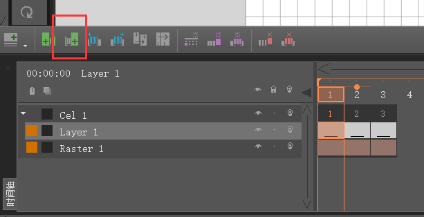
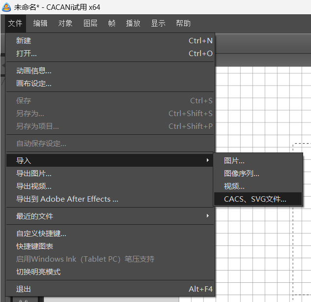
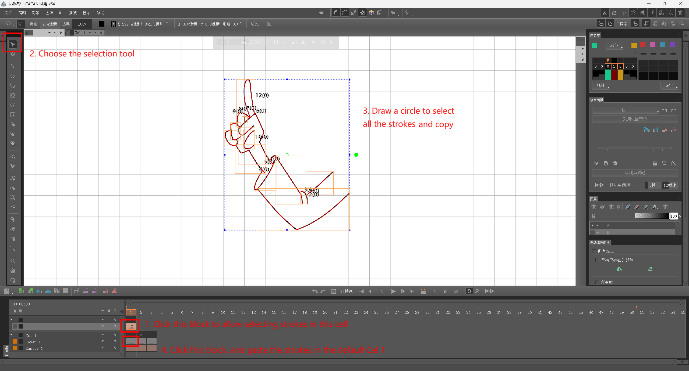
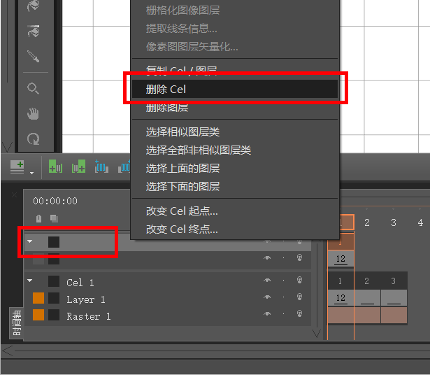
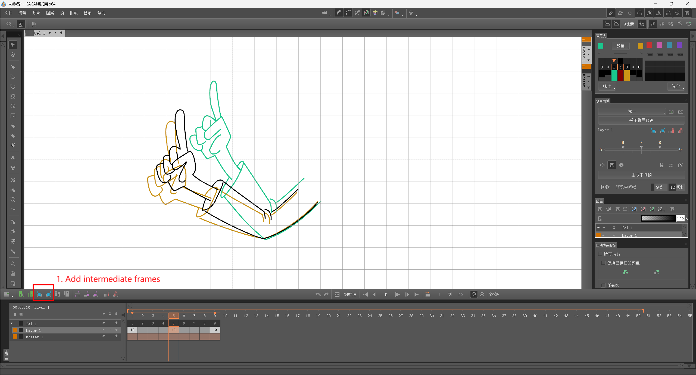
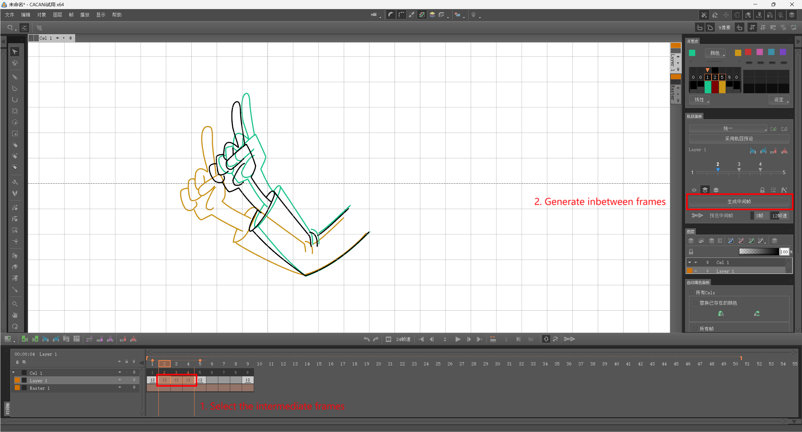
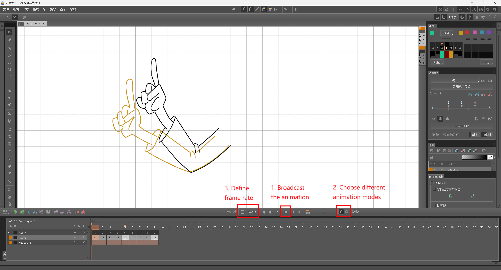

# Make Inbetweening and Animation with CACANi

1. Install [CACANi](https://cacani.sg/).
2. Add keyframes according to the number of SVGs. There are 3 keyframes now:

3. Import SVG files in `separate/` folder one by one: File - Import - CACS/SVG File

4. Note that the imported keyframe is in a new cell. You should copy all the vector strokes to the default cell (Cel 1 - Layer 1): 

5. Delete the cell above. 

6. Repeat step-3 to step-5 to import the other SVGs to the corresponding keyframes. Then, add intermediate frames:

7. Select the empty intermediate frames between two keyframes, and generate the inbetweens. Repeat the process for the other empty intermediate frames.

8. Finally, broadcast the animation. You can choose different animation modes and set different frame rates.

