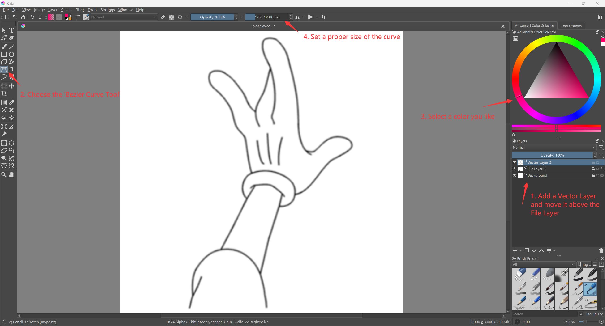
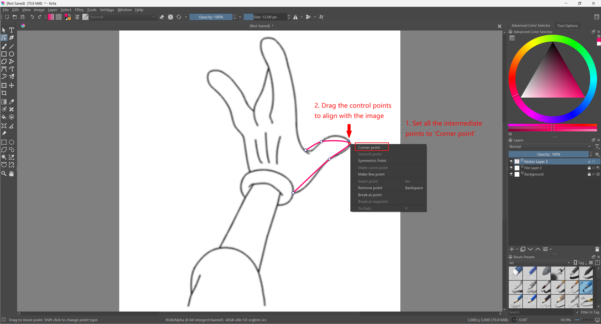
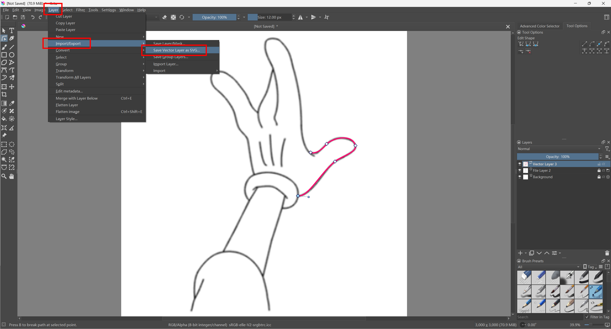

# Make Vector Reference Frame with Krita

1. Install [Krita](https://krita.org/en/)
2. New File - Create (arbitrary configurations)
3. In Layers panel, remove the default Paint Layer. Then, add a File Layer. Select your reference image, and choose the 'Scale to Image Size' option. You will see image now. Remember to lock the layer in the panel.
4. Add a Vector Layer and move it above the File Layer. Then, choose the 'Bezier Curve Tool' on the left. Select any color you like and set the Size of the curve.

5. Trace the drawing. Set all the intermediate points to 'Corner point' for better control. Then, drag them to align the curves with the drawing.

6. After tracing the entire drawing, save it to an svg file: Layer - Import/Export - Save Vector Layer as SVG. Done!

